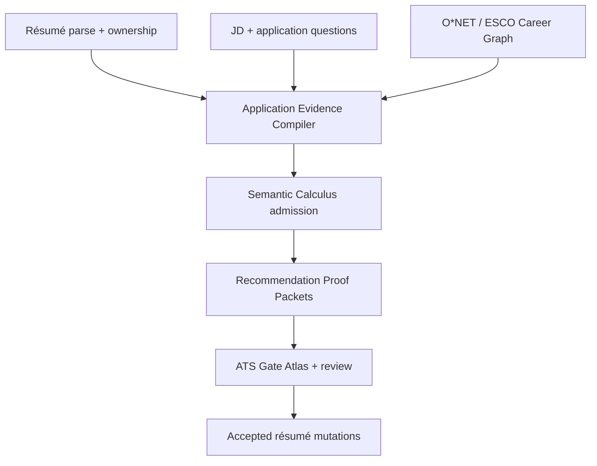

# ATS Implementation and the Scholomance Career Reliability Gap

**Date:** 2026-07-24  
**Scope:** How organizations implement applicant tracking systems; what those implementations imply for a candidate-facing résumé builder; and how Scholomance's existing inventions can close the remaining reliability gaps.

## Executive verdict

The remaining weakness in the Career page is **not insufficient matching power**. It is insufficient *decision evidence around each recommendation*.

Companies do not deploy one universal “ATS algorithm.” They configure a hiring pipeline with different gates:

1. résumé parsing into a candidate profile;
2. employer-defined required fields and knockout questions;
3. keyword, field, Boolean, semantic, or recruiter search;
4. optional ranking or prescreen scoring;
5. human résumé review;
6. assessments, structured interviews, and scorecards;
7. workflow, integrations, reporting, and audit.

Different employers using the same ATS can therefore treat the same résumé differently. Greenhouse documents that parsing fills detected profile fields, may fail on some layouts, and still leaves organization-selected required fields for completion. Lever similarly parses résumés into profile data and provides field/keyword search. Oracle Taleo and SAP SuccessFactors let employers configure prescreening and disqualification questions. Greenhouse’s later-stage structured hiring uses predetermined scorecard criteria. These are not one scoring function; they are separately configured decision surfaces. See the official documentation for [Greenhouse résumé parsing](https://support.greenhouse.io/hc/en-us/articles/200989175-Unsuccessful-resume-parse), [Lever résumé parsing](https://help.lever.co/s/article/Understanding-Resume-Parsing), [Oracle Taleo prescreening](https://docs.oracle.com/en/cloud/saas/taleo-enterprise/21b/otrec/candidate-prescreening.html), [SAP prescreening questions](https://help.sap.com/docs/successfactors-recruiting/recruiting-in-sap-successfactors-test-script/define-pre-screening-questions), and [Greenhouse scorecards](https://support.greenhouse.io/hc/en-us/articles/4414777492891-Scorecard-overview).

That makes a universal “ATS pass score” epistemically indefensible. Your decomposed scorecard is the right foundation. The next system should not compress it back into a vanity number.

The strongest product direction is:

> Build a deterministic **Application Evidence Compiler** that emits a **Recommendation Proof Packet** for every suggested change, then presents those packets through an **ATS Gate Atlas**.

This would transform a card from:

> “Add SQL — 85% confidence.”

into:

> **Name SQL explicitly in the iQor database bullet.**  
> Helps: recruiter search and JD keyword retrieval.  
> JD evidence: “SQL required,” characters 418–430.  
> Résumé evidence: “queried PostgreSQL databases,” iQor entry, characters 1,204–1,234.  
> Relation: `PostgreSQL → technology_example_of → SQL`.  
> Claim status: demonstrated in this entry; no new qualification added.  
> Does not prove: years of SQL experience or proficiency level.  
> Reliability: verified transformation, strong requirement evidence, employer configuration unknown.

That is the missing information density.

---

## 1. Research method and evidence boundary

This report triangulates:

- official product documentation from Greenhouse, Lever, Oracle Taleo, SAP SuccessFactors, Microsoft Dynamics, iCIMS, O*NET, and ESCO;
- official U.S. regulatory guidance from the EEOC, New York City, and NIST;
- peer-reviewed literature and systematic reviews retrieved through Consensus;
- the current Scholomance Career documentation:
  - `CAREER_RESUME_BUILDER_WHITE_PAPER.md`;
  - `2026-07-24-career-graph-onet-esco-turboquant-design.md`;
  - `VERDICT-2026-07-24-CAREER-GRAPH-CORPUS.md`;
  - `2026-07-24-career-jd-improvement-advisor-design.md`;
  - `2026-07-24-career-jd-improvement-advisor.md`.

### Confidence hierarchy used in this report

1. **Highest:** official system behavior, meta-analyses, and systematic reviews.
2. **Strong but contextual:** controlled experiments with recruiters or applicants.
3. **Promising:** evaluated ontology and résumé–JD matching research.
4. **Design hypothesis:** recommendations derived by combining that evidence with Scholomance’s current architecture.

The report deliberately does **not** claim access to proprietary ATS scoring formulas, employer configuration, applicant-pool composition, recruiter search queries, or final hiring criteria. Those are normally unobservable to a candidate-facing product.

---

## 2. How companies actually implement ATS platforms

### 2.1 The enterprise pipeline

| Hiring surface | Typical implementation | What a candidate-facing tool can observe | What remains hidden |
|---|---|---|---|
| Requisition definition | Hiring team creates a role, required criteria, workflow, locations, approvals, and evaluation plan | Job-description language and public application fields | Internal intake notes, budget, calibration decisions, confidential criteria |
| Application intake | Résumé, cover letter, profile fields, source, attachments, demographic/EEO flows | Uploaded file, visible form, candidate-entered answers | Organization-specific required-field configuration |
| Résumé parsing | Parser extracts name, contact data, employers, titles, dates, education, and searchable text | Whether a local parser preserves fields and reading order | Proprietary parser behavior and error correction |
| Prescreen/knockout | Employer configures disqualification questions, minimum qualifications, credentials, work authorization, location, schedule, or salary constraints | Visible application questions; some explicit JD requirements | Hidden auto-disqualification rules and answer weights |
| Retrieval | Recruiters search candidate fields, résumé text, titles, tags, keywords, or saved filters | Candidate can improve truthful searchability | Actual recruiter query, query timing, candidate-pool competition |
| Ranking/prescreen score | Some platforms or add-ons weight keywords, fields, experience, questions, or model-derived fit | A tool can model bounded scenarios | Vendor model, employer weights, thresholds, training data |
| Human triage | Recruiter skims résumé and application profile | Readability, relevance order, evidence clarity | Recruiter workload, preferences, and time pressure |
| Structured assessment | Competency scorecards, interview plans, work samples, tests, and panel feedback | Publicly named competencies and interview process | Internal score anchors, interviewer behavior, competing candidates |
| Workflow/integration | Stage transitions, notifications, HRIS handoff, background checks, analytics, APIs | Candidate status and visible communication | Internal permissions, automation rules, reports, and downstream systems |

This implementation pattern is visible across vendors:

- Greenhouse says résumé parsing scans an imported résumé and auto-fills fields it detects. It also warns that some layouts can upload information incorrectly and tells recruiters to verify the profile. Organization-selected required fields may still need manual completion. [Greenhouse parsing documentation](https://support.greenhouse.io/hc/en-us/articles/115002195063-Manually-add-a-candidate-or-prospect).
- Lever says its parser extracts information into the candidate profile, while its database search supports keywords and searchable fields. [Lever parsing](https://help.lever.co/s/article/Understanding-Resume-Parsing) and [Lever candidate search](https://help.lever.co/hc/en-us/articles/20087317030685-Searching-the-Database-for-Candidates).
- Oracle Taleo supports disqualification questions, competencies, and prescreen questions; responses can determine whether a candidate proceeds or is automatically disqualified. [Taleo Recruiting guide](https://docs.oracle.com/en/cloud/saas/taleo-enterprise/otfru/using-recruiting.pdf).
- SAP SuccessFactors explicitly places minimum screening-question selection in the hands of the recruiter and hiring manager and later records competency/interview ratings. [SAP prescreening](https://help.sap.com/docs/successfactors-recruiting/recruiting-in-sap-successfactors-test-script/define-pre-screening-questions) and [SAP interview ratings](https://help.sap.com/docs/successfactors-recruiting/setting-up-and-maintaining-sap-successfactors-recruiting/assigning-and-editing-ratings-in-interview-assessments).
- Greenhouse’s structured process begins with role criteria and uses predetermined scorecards rather than an undifferentiated résumé score. [Structured hiring guide](https://support.greenhouse.io/hc/en-us/articles/360039539772-Structured-hiring-guide).
- Microsoft documents ATS integration as a distinct interface between recruiting systems and the HR system of record. This reinforces that an ATS is also workflow and data infrastructure, not merely a résumé grader. [Dynamics ATS integration API](https://learn.microsoft.com/en-us/dynamics365/human-resources/hr-admin-integration-ats-api-introduction).

### 2.2 “The ATS rejected me” is often an underspecified claim

An application can disappear at several different points:

- a hard screening answer can disqualify it;
- parsing can put information in the wrong fields;
- a recruiter search may never retrieve it;
- an optional ranking module may place it low;
- a human reviewer may reject it;
- an assessment or interview scorecard may eliminate it;
- the requisition may be paused, filled internally, or changed.

The Career page should therefore replace the mental model of one invisible robot with a **gate-specific model**. This is both more accurate and more actionable.

### 2.3 The lawful product claim

Scholomance can reliably claim:

> “This change improves evidence visibility under these documented hiring surfaces while preserving the candidate’s facts.”

It cannot reliably claim:

> “This raises your probability of passing ATS X from 63% to 81%.”

The second claim would require the employer configuration, applicant pool, selection threshold, downstream assessment process, and outcome data. None are available from the résumé and JD alone.

---

## 3. What the research says about reliability

### 3.1 Automation improves throughput, not epistemic certainty

A 2025 systematic review of 49 papers found that AI recruitment can improve productivity through parsing and initial screening, but also emphasized algorithmic bias and transparency risks [1]. A 2022 ethics review of 51 papers similarly mapped both benefits and unresolved risks across job-ad writing, résumé screening, and later assessments [2].

**Implication for Career:** efficiency evidence does not validate a recommendation as a predictor of hiring or job performance. The UI must distinguish:

- “likely to parse”;
- “likely to be searchable”;
- “aligned with the public JD”;
- “supported by candidate evidence”;
- “predictive of job performance.”

Those are different propositions.

### 3.2 Recruiters can distrust algorithms and still be misled by them

In an experiment with 694 recruiting professionals, recruiters generally trusted human recommendations more than algorithmic ones. Yet inconsistent algorithmic advice could still distort decisions enough that unsuitable résumés were favored over suitable ones [3].

**Implication for Career:** explanation cannot be ornamental. A polished confidence badge attached to weak evidence can increase the danger of automation bias. The system needs:

- visible source evidence;
- visible uncertainty;
- alternative interpretations;
- a meaningful refusal state;
- user control over acceptance;
- no visual treatment that implies stronger certainty than the data supports.

Your Semantic Calculus margin law maps unusually well to this requirement.

### 3.3 Résumé variables are not equivalent to job-performance predictors

Updated meta-analytic work concluded that personnel-selection validity had often been overstated; structured interviews emerged as the top-ranked selection procedure in the revised estimates [4]. A separate meta-analysis of 81 samples found that common measures of prehire experience correlated only weakly with later job performance (`r = .06`), training performance (`r = .11`), and turnover (`r = .00`) [5].

This does **not** mean experience is irrelevant. It means:

- “five years” should not automatically dominate “clear task evidence”;
- a résumé matcher should not pose as a job-performance predictor;
- task-level evidence and later structured assessment matter;
- Career should optimize access to human evaluation, not claim to settle qualification.

This also supports separating:

1. **eligibility evidence**;
2. **search/retrieval evidence**;
3. **task evidence**;
4. **impact evidence**;
5. **later assessment targets**.

### 3.4 Applicant trust depends on job-relatedness, control, and explanation

A meta-analysis covering 86 samples and 48,750 participants found that applicant perceptions affect organizational attraction, offer acceptance intentions, and recommendations; face validity and perceived predictive validity were important [6]. Automated screening has also been rated lower than traditional screening on perceived job relatedness, opportunity to perform, reconsideration, communication, and interpersonal treatment, though higher on consistency [14].

Explanations improve perceived outcome and process fairness in hiring scenarios [10], and human-led or balanced human–AI structures are perceived as fairer than AI-led screening, especially after rejection [11]. Human-centered explanation research also ties understanding of the linkage between explanation and result to trust and acceptance [12].

**Implication for Career:** every recommendation card should answer:

- Why is this job-related?
- What evidence produced it?
- What can the candidate change?
- What can the candidate contest?
- What would cause the system to withdraw the advice?
- What does the recommendation *not* establish?

### 3.5 Ontologies help, but traceability is the real advantage

Research using O*NET with semantic models reports improved résumé/job matching over simpler baselines [7]. Ontology-based skills matching has shown contextual improvements over keyword baselines on real datasets [8]. Work on explainable résumé–JD systems explicitly identifies the need to combine skill ontologies with detailed, traceable explanations and stakeholder-specific evidence [9].

This validates the direction of your Career Graph:

- O*NET/ESCO establish canonical concepts and explicit relations;
- lexical/FTS traversal admits candidates;
- TurboQuant may rerank a lawful frontier;
- résumé spans remain the authority for whether the candidate demonstrated a skill;
- the graph explains *why two phrases are related*, not *whether the candidate owns a claim*.

### 3.6 Human résumé inference is also unreliable

In a study involving 244 recruiters, personality inferences made from résumés showed low interrater reliability and generally lacked validity, yet still influenced employability judgments [13]. Small biases can also accumulate into practically meaningful hiring disparities across a funnel [15].

**Implication for Career:** do not add “leadership personality,” “culture fit,” “confidence,” or similar latent-trait claims from résumé prose. The legitimate unit is an observable claim tied to a task, result, credential, or candidate-confirmed fact.

---

## 4. What Scholomance already gets right

Based on the current internal white paper and design archive, the Career system already has several unusually strong foundations:

1. **Parse before interpretation.** Pasted text, TXT, DOCX, and text-layer PDF become a structured document with raw-coordinate spans.
2. **Human parse review.** The candidate sees the machine’s interpretation before analysis.
3. **Refusal over OCR guessing.** Image-only PDF refusal is honest and ATS-relevant.
4. **Decompressed scorecard.** Parse quality, section coverage, literal keyword coverage, canonical skill coverage, legibility, and formatting risk remain separate.
5. **Strict phrase matching.** Scattered components do not masquerade as a contiguous phrase.
6. **Amplify-only law.** Suggestions are reviewable, reversible, and designed not to add factual claims.
7. **Sentinel-backed quantification.** A missing metric cannot silently reach export.
8. **Stale-span protection.** A suggestion cannot edit bytes it no longer owns.
9. **Local-first processing.** Candidate documents remain in browser memory.
10. **Graph law before vector intuition.** O*NET/ESCO relations establish authority; TurboQuant is bounded.
11. **Deterministic identity and ordering.** Same input produces the same proposal set.
12. **Output-level testing exists.** The builder now tests applied résumé text, not only suggestion objects.

The repaired graph report records 9,808 concepts, 63,114 skill edges, and 90.9% O*NET occupation coverage. That removes the earlier “small engineering lexicon” bottleneck. However, the archive also says:

- ESCO and the O*NET–ESCO crosswalk remain synthetic fixtures;
- the live SQLite-WASM path still needs production build and browser click-through verification;
- the published shards need a deploy pre-build guarantee;
- the graph changes were built and tested but were not yet committed at the time of the verdict.

The report therefore treats the graph as a strong working-tree capability, not as a fully verified production fact.

---

## 5. The remaining gaps, ranked

## P0 — Claim ownership is not structurally complete

The most dangerous failure is not a weak synonym. It is a true bullet moving under the wrong employer.

Current work has identified concrete failure modes such as:

- an iQor achievement exported under GC Services;
- a bullet crossing an experience-entry boundary;
- a skill leaking across sections;
- a team-size answer becoming a factual claim without durable candidate-input provenance.

The parser needs a first-class experience-entry model:

```ts
interface ResumeExperienceEntry {
  id: string;
  employer: ProvenancedField<string>;
  title: ProvenancedField<string>;
  location?: ProvenancedField<string>;
  startDate?: ProvenancedField<ResumeDate>;
  endDate?: ProvenancedField<ResumeDate>;
  bulletIds: string[];
  sourceSpan: TextSpan;
}

interface ResumeBullet {
  id: string;
  sectionId: string;
  entryId?: string;
  rawText: string;
  sourceSpan: TextSpan;
}
```

Required invariants:

- an experience bullet with an `entryId` may never move to another entry;
- a rewrite may modify text but not change ownership;
- an insertion must declare its target section and entry;
- export must preserve entry boundaries;
- parse → export → parse must reproduce employer-to-bullet assignments.

Until these are first-class, a recommendation can be textually truthful and structurally false.

## P0 — The requirement ledger does not yet model employer intent deeply enough

A stemmed unigram/bigram ledger plus nearby cue words is a useful candidate generator. It is not yet a full requirement model.

The JD parser must distinguish:

- required vs preferred vs optional;
- qualification vs responsibility vs company description;
- current requirement vs historical narrative;
- negated statements;
- skill vs credential vs license vs education;
- years-of-experience constraints and what object the years bind to;
- location, schedule, travel, clearance, work authorization, and physical requirements;
- salary and employment type;
- application-only questions that the JD cannot reveal;
- ambiguous scope, such as whether “three years” binds to Python, leadership, or the whole role.

Proposed contract:

```ts
type RequirementKind =
  | 'skill'
  | 'task'
  | 'credential'
  | 'education'
  | 'experience_duration'
  | 'work_authorization'
  | 'location'
  | 'schedule'
  | 'travel'
  | 'clearance'
  | 'physical'
  | 'other';

type RequirementModality =
  | 'required'
  | 'preferred'
  | 'optional'
  | 'descriptive'
  | 'negated'
  | 'ambiguous';

interface JobRequirement {
  id: string;
  surface: string;
  kind: RequirementKind;
  modality: RequirementModality;
  canonicalConceptId?: string;
  boundQuantity?: {
    value: number;
    unit: 'year' | 'month' | 'percent' | 'count' | 'other';
    bindsToConceptId?: string;
  };
  evidenceSpans: TextSpan[];
  extractionBasis: EvidenceBasis[];
  alternatives: RequirementInterpretation[];
  state: 'clear' | 'ambiguous' | 'unbound';
}
```

Leximancy should perform phrase binding and ambiguity preservation here. Semantic Calculus should decide whether the extracted requirement is clear enough to authorize a recommendation.

## P0 — Recommendations lack a complete proof packet

The current `ResumeSuggestion` has useful fields—before, after, span, evidence, risk, confidence, and approval—but it does not yet answer all of the candidate’s decision questions.

Add a separate packet rather than bloating the mutation object:

```ts
type AtsGate =
  | 'parse'
  | 'required_field'
  | 'knockout'
  | 'retrieval'
  | 'ranking'
  | 'human_triage'
  | 'structured_assessment';

interface RecommendationProofPacket {
  schemaVersion: 1;
  recommendationId: string;
  requirementId?: string;
  affectedGates: {
    gate: AtsGate;
    expectedEffect: 'improves' | 'protects' | 'neutral' | 'unknown';
    basis: EvidenceBasis[];
  }[];
  jdEvidence: EvidenceSpan[];
  resumeEvidence: EvidenceSpan[];
  claimOwners: {
    sectionId: string;
    entryId?: string;
    bulletId?: string;
  }[];
  ontologyPaths: OntologyRelationPath[];
  assumptions: Assumption[];
  counterEvidence: EvidenceSpan[];
  cannotEstablish: string[];
  reliability: RecommendationReliability;
  provenance: {
    parserVersion: string;
    graphManifest: string;
    calculusVersion: string;
    ruleVersion: string;
  };
  checksum: string;
}
```

This packet is analysis evidence. `ResumeSuggestion` remains the proposed edit. The separation prevents UI explanation from becoming mutation authority.

## P0 — Missing application-question envelope

Employer ATS implementations often use required questions that do not belong in the résumé:

- Are you legally authorized to work here?
- Will you require sponsorship?
- Do you hold license X?
- Can you work the stated shift?
- Are you willing to travel?
- Can you pass a background or clearance requirement?
- What is your compensation expectation?

The résumé builder should never recommend stuffing these answers into résumé prose merely to improve “coverage.”

Add a local-only **Application Fact Envelope**:

```ts
interface CandidateApplicationFact {
  id: string;
  kind: RequirementKind;
  value: string | boolean | number;
  source: 'candidate_input';
  capturedAtRevision: string;
  usableFor: ('screening_answer' | 'resume' | 'cover_letter')[];
  candidateConfirmed: true;
}
```

This gives the recommendation engine more information while preserving channel boundaries.

## P1 — Match relation and possession evidence are conflated

“PostgreSQL is related to SQL” is ontology evidence.  
“This candidate used PostgreSQL at iQor” is résumé evidence.  
“This candidate has five years of SQL” requires temporal and ownership evidence.  
“SQL is required for this role” is JD evidence.

These should never collapse into one confidence value.

Use two orthogonal classifications:

```ts
type MatchRelation =
  | 'exact'
  | 'normalized'
  | 'alias'
  | 'technology_example'
  | 'task_bridge'
  | 'graph_related'
  | 'semantic_only';

type CandidateSupport =
  | 'explicit'
  | 'corroborated'
  | 'inferred'
  | 'adjacent'
  | 'contradicted'
  | 'missing'
  | 'ambiguous';
```

Graph and Leximancy establish the first. Résumé spans, entry ownership, and candidate confirmation establish the second.

## P1 — “Confidence” is overloaded

A suggestion can have:

- perfect span confidence;
- strong requirement confidence;
- weak candidate-evidence confidence;
- perfect truth-preservation;
- unknown employer applicability.

One “85%” hides this structure.

Use an evidence vector:

```ts
interface RecommendationReliability {
  parseAdequacy: number;
  requirementAdequacy: number;
  ownershipAdequacy: number;
  candidateEvidenceAdequacy: number;
  transformationAdequacy: number;
  gateApplicabilityAdequacy: number;
  configurationUncertainty: 'low' | 'medium' | 'high';
  tier: 'verified' | 'supported' | 'review_required' | 'suppressed';
}
```

Before empirical calibration, these values must be described as **evidence adequacy**, not probabilities.

A conservative deterministic floor can be:

\[
R_{\text{floor}}(s) =
H(s)\min(P_s,Q_s,O_s,E_s,T_s,G_s)
\]

where:

- \(H(s)\in\{0,1\}\) is the conjunction of hard invariants;
- \(P\) is parse adequacy;
- \(Q\) is requirement adequacy;
- \(O\) is ownership adequacy;
- \(E\) is candidate-evidence adequacy;
- \(T\) is truth-preservation adequacy;
- \(G\) is gate-applicability adequacy.

The weakest-link minimum is intentionally unforgiving. A recommendation with excellent wording and weak ownership remains weak.

Priority is a different calculation:

\[
\text{Priority}(s)=
R_{\text{floor}}(s)
\times W_{\text{requirement}}
\times U_{\text{gate}}
\times V_{\text{reversibility}}
\]

Do not use priority as a synonym for reliability.

Release thresholds should be calibrated on a labeled benchmark; the formula should not ship with aesthetically chosen percentages.

## P1 — No counterfactual or abstention explanation

For every recommendation, generate:

- **accept:** what changes and which gates may benefit;
- **reject:** what remains unchanged;
- **edit:** which facts the candidate must confirm;
- **refuse:** why the system cannot advise.

Example:

> “The JD says ‘five years of SQL.’ Your résumé explicitly shows SQL in two roles, but date binding is ambiguous. I cannot claim five years. You can confirm the first-use date, leave the résumé unchanged, or add a truthful duration if you can support it.”

That is much more reliable than “Missing: five years SQL.”

## P1 — Graph and runtime state still need promotion gates

Before Career Graph-derived recommendations are treated as production-grade:

- replace ESCO and crosswalk fixtures with the pinned real releases;
- run production `vite build`;
- verify SQLite-WASM, worker chunks, FTS, and shards in a real browser;
- wire `career:graph:publish` into deploy pre-build;
- preserve a manifest and checksum in every proof packet;
- test degradation with graph unavailable.

The key degradation law should remain:

> A failed semantic or graph layer may reduce certainty or remove advice; it may never make advice more speculative.

---

## 6. The Scholomance-native architecture

## 6.1 Application Evidence Compiler



Responsibilities:

1. normalize résumé claims without losing raw spans;
2. bind every claim to its section and experience entry;
3. extract JD requirements with modality and scope;
4. map public requirements to canonical graph concepts;
5. keep application-only facts outside résumé text;
6. construct evidence and counterevidence;
7. ask Semantic Calculus whether a transformation is authorized;
8. emit a proof packet and, only then, a suggestion.

## 6.2 ATS Gate Atlas

The candidate should see readiness by hiring surface:

| Gate | User-facing question | Example finding |
|---|---|---|
| Parse | Did the exported document preserve fields and reading order? | “Two dates were assigned to the wrong employer.” |
| Required fields | Is the application profile complete? | “Phone field is missing from the parsed profile.” |
| Knockout | Are there unanswered hard constraints? | “Work authorization is unverified; do not add it to résumé prose.” |
| Retrieval | Are truthful role terms searchable? | “PostgreSQL evidence exists, but the JD searches for SQL.” |
| Ranking | Under bounded documented scenarios, which criteria receive evidence? | “Strong skill evidence; employer weighting unknown.” |
| Human triage | Can a recruiter find the relevant proof quickly? | “The strongest SQL bullet is fourth under the correct employer.” |
| Structured assessment | What will likely need later proof? | “Prepare a work example for database optimization.” |

This is a better product than an ATS meter because it points to different interventions.

## 6.3 Recommendation types by gate

| Recommendation | Parse | Knockout | Retrieval/ranking | Human triage | Assessment |
|---|---:|---:|---:|---:|---:|
| Fix multi-column/export structure | High | None | Medium | Medium | None |
| Correct employer/date ownership | High | Low | High | High | Medium |
| Name a canonical skill already demonstrated | None | Low | High | High | Medium |
| Add a candidate-confirmed license | Low | High | High | High | High |
| Quantify a real result | None | None | Low | High | Medium |
| Reorder strongest relevant bullet within the same entry | None | None | Medium | High | Medium |
| Add a never-demonstrated keyword | None | Dangerous | Dangerous | Dangerous | Dangerous |
| Prepare a work-sample example | None | None | None | Low | High |

The UI should show these distinctions directly. Quantification is usually a human-triage improvement, not a universal ATS optimization.

---

## 7. How to use the bespoke inventions

| Scholomance invention | Career role | Reliability law |
|---|---|---|
| **Career Graph / SQLite** | Canonical occupations, skills, tasks, technologies, aliases, relations, and source versions | Graph explains relations; it never proves candidate possession |
| **O*NET + ESCO crosswalk** | Multi-ontology bridge and occupation context | `mapped_to`, never silently `same_as`; retain source namespace and provenance |
| **Leximancy** | Requirement phrase binding, part-of-speech/sense resolution, negation, modality, quantity binding, and evidence trace | Preserve alternatives when phrase scope is ambiguous |
| **Semantic Calculus** | Permission compiler for whether a recommendation may be emitted | Evidence before explanation; margin law; refusal is a valid result |
| **Semantic Ballistics** | Rank senses/relations within an admitted candidate set when the production contract exists | Never create authority or erase ambiguity |
| **TurboQuant** | Fast local reranking of lawful graph candidates or requirement–evidence links | Rerank only; never mint a skill, requirement, or claim |
| **Constellation OS** | Run multiple observable ATS scenarios and collect measurements, counterexamples, and falsification predicates | Harness collects observations; it does not turn scenarios into facts |
| **Fingerprint/decryption gate** | Stable identity, deduplication, revision invalidation, and proof-packet sealing | A packet decrypts to an actionable suggestion only when all authority checks pass |
| **Compose** | Render the Gate Atlas and proof packets as deterministic UI scenes with clear states | Visual confidence may not exceed evidence confidence |
| **ParserPreviewDrawer** | Show the candidate exactly what a parser recovered and where structure is uncertain | Review happens before analysis |
| **HMM legibility** | Detect machine-mangled lines and export degradation | Legibility is one channel, not an overall qualification score |
| **Sentinel + stale-span guard** | Candidate-supplied metrics and safe application | Unfilled or stale proposals cannot reach export |

### 7.1 Fingerprint proposal

Each recommendation should have a content-derived fingerprint over:

```text
schemaVersion
documentRevision
jobDescriptionRevision
requirementId
resumeEvidenceSpanIds
claimOwnerIds
ontologyRelationPathIds
ruleVersion
proposedOperation
```

If any input changes, the proof packet becomes stale and must be recomputed. This directly applies the fingerprint/decryption idea to the reliability problem:

- matching fingerprint → packet may be reviewed;
- stale fingerprint → packet cannot apply;
- failed authority gate → packet never decrypts into a mutation capability.

### 7.2 Constellation OS proposal

Use Constellation OS as an **ATS scenario observatory**, not as an oracle:

```ts
interface AtsScenarioObservation {
  profileId: 'parser_strict' | 'keyword_search' | 'prescreen_hard_gate' | 'human_triage';
  observations: RawObservation[];
  prediction: string;
  falsifier: Predicate;
  status: 'observed' | 'unsupported' | 'error';
}
```

Examples:

- strict parser profile: exported DOCX re-parses with preserved employer/title/date/bullet ownership;
- keyword search profile: exact and alias retrieval are compared;
- hard-gate profile: unanswered application facts remain visible;
- human-triage profile: relevant evidence position and clarity are measured.

Do not average these into a pass probability.

---

## 8. Recommendation-card redesign

Each card should contain, in this order:

1. **Action** — the proposed change in plain language.
2. **Gate impact** — parse, knockout, retrieval, human triage, or assessment.
3. **Requirement evidence** — exact JD excerpt and modality.
4. **Candidate evidence** — exact résumé excerpt and owning employer/role.
5. **Relation path** — exact, alias, technology example, task bridge, or semantic-only.
6. **Truth boundary** — what the edit preserves and what it cannot claim.
7. **Reliability vector** — decomposed evidence adequacy, not one probability.
8. **Assumptions** — especially employer-configuration uncertainty.
9. **Counterfactual** — effect of accepting, editing, or rejecting.
10. **Provenance** — parser, graph, rule, and document revisions.

Suggested compact rendering:

| Field | Example |
|---|---|
| Recommendation | “Change ‘Postgres reporting’ to ‘SQL/PostgreSQL reporting.’” |
| Helps | Recruiter search; JD retrieval |
| JD proof | “SQL required” |
| Résumé proof | iQor → “Developed reports using PostgreSQL” |
| Relation | PostgreSQL → technology example → SQL |
| Candidate support | Explicit technology use |
| Cannot establish | SQL proficiency level; years of SQL |
| Reliability | Verified transformation; strong evidence; configuration unknown |
| If accepted | Adds truthful canonical vocabulary |
| If rejected | Existing PostgreSQL evidence remains intact |

This directly addresses the user’s feeling that recommendations do not contain enough information to be reliable choices.

---

## 9. Validation and benchmark program

The scientific literature supports ontologies and explainability, but it does not validate *your specific implementation*. That requires an internal benchmark.

## 9.1 Gold corpus

Create a versioned benchmark with:

- multiple industries, not only software;
- entry-level, mid-career, career-change, and nontraditional résumés;
- DOCX, TXT, and text-layer PDF;
- one-column, mild formatting variation, tables, headers/footers, and deliberate failure cases;
- JDs with required/preferred/negated/ambiguous requirements;
- application-question fixtures;
- employer/title/date/bullet ownership labels;
- canonical O*NET/ESCO concepts and relation-path labels;
- human-reviewed recommendation judgments.

Every fixture should have source/license status and a stable checksum.

## 9.2 Metrics

| Layer | Metric | Release posture |
|---|---|---|
| Parsing | field precision/recall/F1 | Report by field type |
| Ownership | employer→title→date→bullet assignment | 100% on accepted export operations |
| Requirement extraction | macro-F1 by kind and modality | Required, preferred, negated, ambiguous separately |
| Quantity binding | exact binding accuracy | No duration recommendation if unbound |
| Concept normalization | precision@1, recall@k, MRR | Exact/alias/graph/semantic ablations |
| Evidence linking | precision/recall by support tier | False “demonstrated” is more costly than false “missing” |
| Suggestion factuality | unsupported-claim rate | **0 accepted unsupported claims** |
| Provenance | packets with complete spans/owners/versions | 100% |
| Ranking | NDCG@k against human usefulness labels | Only after admission gates |
| Determinism | byte-identical packet set | 100% for identical inputs and versions |
| Degradation | graph/worker failure behavior | Advice becomes narrower, never more speculative |
| Export | structural round-trip invariants | Employer and section ownership preserved |
| Calibration | Brier score/ECE | Only if outputs are later framed probabilistically |

## 9.3 Critical falsification tests

1. A GC Services bullet can never move under iQor.
2. A metric entered for one bullet cannot bind to another.
3. “SQL is not required” cannot create a required SQL recommendation.
4. “Python preferred” cannot become a knockout condition.
5. “Five years of experience with Python and SQL” must preserve alternative bindings when grammar is ambiguous.
6. A requirement found only in company boilerplate cannot become candidate advice.
7. PostgreSQL may bridge to SQL, but it cannot establish five years of SQL.
8. A semantic-only neighbor cannot be labeled demonstrated.
9. A missing work-authorization answer cannot become résumé text.
10. A graph outage must produce `error`/degraded state, not empty evidence.
11. Same résumé + same JD + same manifests must produce byte-identical proof packets.
12. Changing the JD revision must stale every dependent packet.
13. Exported DOCX must contain no tables/text boxes/header-dependent contact information.
14. Parse → export → parse must preserve section and entry ownership.
15. A proof packet with any failed hard invariant cannot decrypt into an applicable mutation.
16. Two different JDs for the same occupation must produce materially different requirement ledgers and priorities.

## 9.4 Ablations

Measure the system with:

- exact matching only;
- exact + aliases;
- graph relations;
- graph + task bridges;
- graph frontier + TurboQuant reranking;
- full system without Leximancy ambiguity handling;
- full system without ownership gates.

The last two should become visibly worse. If removing a component does not reduce measured quality, that component is ornamental.

---

## 10. Implementation roadmap

### Phase 0 — Trust-critical structure

1. Add `ResumeExperienceEntry` and `entryId`.
2. Enforce same-entry movement and section ownership.
3. Add candidate-input provenance for every new fact or metric.
4. Replace ceremonial export tests with structural parse/export/parse round trips.
5. Surface skipped/conflict/stale reasons in the review UI.

**Exit gate:** no accepted operation can change factual ownership.

### Phase 1 — Recommendation Proof Packets

1. Add `AtsGate`.
2. Add `RecommendationProofPacket`.
3. Separate mutation objects from evidence packets.
4. Add `cannotEstablish`, assumptions, counterevidence, and version manifests.
5. Fingerprint the packet against résumé/JD revisions and relation paths.

**Exit gate:** every visible recommendation answers “why, where, based on what, and what not.”

### Phase 2 — Requirement and application evidence

1. Extend the ledger with kind, modality, negation, and quantity binding.
2. Add the local Application Fact Envelope.
3. Keep screening-answer advice separate from résumé edits.
4. Use Leximancy for phrase binding and Semantic Calculus for admission/refusal.

**Exit gate:** hard requirements, preferences, responsibilities, and application questions cannot collapse into one keyword list.

### Phase 3 — Gate Atlas and scenario observatory

1. Render parse, required-field, knockout, retrieval, human-triage, and assessment lanes.
2. Add bounded ATS behavior profiles from official documentation.
3. Use Constellation OS to run scenarios with explicit falsifiers.
4. Keep profiles descriptive, versioned, and non-proprietary.

**Exit gate:** the page never implies one universal ATS.

### Phase 4 — Graph and semantic promotion

1. Replace ESCO/crosswalk fixtures.
2. production-build and browser-verify SQLite-WASM and shards;
3. make graph publishing a deploy prerequisite;
4. add TurboQuant only as an evaluated reranker;
5. run ablations and calibrate evidence thresholds.

**Exit gate:** semantic power improves ranking without increasing unsupported recommendations.

### Phase 5 — Human validation

1. Recruit HR/recruiter reviewers across more than one occupation family.
2. Blind-review recommendation usefulness, truthfulness, and gate attribution.
3. Measure agreement and adjudicate disagreements.
4. Run candidate usability testing on explanation comprehension.
5. Publish a capability statement with failure boundaries.

**Exit gate:** “reliable” is supported by measured precision and human comprehension, not test count alone.

---

## 11. Product positioning

Most résumé products compete on:

- keyword count;
- opaque match percentage;
- generic action verbs;
- generative rewriting;
- unverified claims about beating ATS platforms.

Scholomance can occupy a better category:

> **An evidence compiler for job applications.**

Its differentiators would be:

- parse-visible;
- employer/entry-aware;
- ontology-grounded;
- locally executed;
- deterministic;
- provenance-sealed;
- ambiguity-preserving;
- refusal-capable;
- candidate-controlled;
- gate-specific rather than mythologizing one ATS score.

This is more defensible scientifically and more coherent with the rest of Scholomance.

---

## 12. Final recommendation

Do **not** spend the next cycle trying to make the current recommendation list larger.

Spend it making every existing recommendation harder to earn and easier to interrogate.

The highest-leverage sequence is:

1. structural ownership;
2. proof packets;
3. gate attribution;
4. requirement modality;
5. application-fact envelope;
6. scenario Atlas;
7. calibrated semantic reranking.

The core principle is:

> A recommendation is reliable when the candidate can inspect its entire authority chain and when any broken link causes refusal.

That is precisely the kind of problem Semantic Calculus, fingerprints, Constellation OS, TurboQuant, Leximancy, and Compose were built to solve together.

---

## Scientific references

[1] [Role of artificial intelligence in employee recruitment: systematic review and future research directions](https://consensus.app/papers/role-of-artificial-intelligence-in-employee-recruitment-dadaboyev-abdullayeva/05ba080746b35b718345ea04a91c34f5/?utm_source=chatgpt) — S. Dadaboyev, Jasmina Abdullayeva, Naval Abbosova, Afina Suleymenova, and Komila Mamadjanova. 2025. *Discover Global Society*, vol. 3. Consensus citation count: 11.

[2] [Ethics of AI-Enabled Recruiting and Selection: A Review and Research Agenda](https://consensus.app/papers/ethics-of-aienabled-recruiting-and-selection-a-review-and-hunkenschroer-luetge/bcfcf12ba3cc548b8cf09eba5b3c8307/?utm_source=chatgpt) — A. Hunkenschroer and C. Luetge. 2022. *Journal of Business Ethics*, vol. 178, pp. 977–1007. Consensus citation count: 319.

[3] [Should I Trust the Artificial Intelligence to Recruit? Recruiters’ Perceptions and Behavior When Faced With Algorithm-Based Recommendation Systems During Resume Screening](https://consensus.app/papers/should-i-trust-the-artificial-intelligence-to-recruit-lacroux-martin-lacroux/80f39701fcd95b76995b78fc64be4806/?utm_source=chatgpt) — Alain Lacroux and Christelle Martin-Lacroux. 2022. *Frontiers in Psychology*, vol. 13. Consensus citation count: 45.

[4] [Revisiting meta-analytic estimates of validity in personnel selection: Addressing systematic overcorrection for restriction of range](https://consensus.app/papers/revisiting-metaanalytic-estimates-of-validity-in-sackett-zhang/b83bef5f9d165d01b084dc2325e2b994/?utm_source=chatgpt) — P. Sackett, Charlene Zhang, Christopher M. Berry, and F. Lievens. 2021. *Journal of Applied Psychology*. Consensus citation count: 234.

[5] [A meta-analysis of the criterion-related validity of prehire work experience](https://consensus.app/papers/a-metaanalysis-of-the-criterionrelated-validity-of-iddekinge-arnold/7e3964708e0357bcbe3254226c7f09ab/?utm_source=chatgpt) — Chad H. Van Iddekinge, J. Arnold, Rachel E. Frieder, and P. Roth. 2019. *Personnel Psychology*. Consensus citation count: 46.

[6] [Applicant Reactions to Selection Procedures: An Updated Model and Meta-Analysis](https://consensus.app/papers/applicant-reactions-to-selection-procedures-an-updated-hausknecht-day/38612113c9265a09b4e10e94655f73e6/?utm_source=chatgpt) — John P. Hausknecht, D. Day, and Scott Thomas. 2004. *Personnel Psychology*, vol. 57, pp. 639–683. Consensus citation count: 801.

[7] [A novel approach for job matching and skill recommendation using transformers and the O*NET database](https://consensus.app/papers/a-novel-approach-for-job-matching-and-skill-recommendation-alonso-dess/b70f1cac587c52b89f8874b136444dd6/?utm_source=chatgpt) — Rubén Alonso, D. Dessí, Antonello Meloni, and D. Recupero. 2025. *Big Data Research*, vol. 39, article 100509. Consensus citation count: 13.

[8] [Ontology and its applications in skills matching in job recruitment](https://consensus.app/papers/ontology-and-its-applications-in-skills-matching-in-job-chi-tuan/ba6e1feab2aa59218948dde27c684fe2/?utm_source=chatgpt) — Tuan Anh Chi, D. Tuan, H. Do, V. Solanki, Jorge Torres, Rubén González Crespo, and T. Nguyen. 2024. *Applied Ontology*, vol. 19, pp. 287–306. Consensus citation count: 5.

[9] [Toward a traceable, explainable, and fair JD/Resume recommendation system](https://consensus.app/papers/toward-a-traceable-explainable-and-fairjdresume-barrak-adams/594e17f2e62a5c349966a531d44b68b8/?utm_source=chatgpt) — Amine Barrak, Bram Adams, and A. Zouaq. 2022. *arXiv*, abs/2202.08960. Consensus citation count: 4.

[10] [Rejected by an AI? Comparing job applicants’ fairness perceptions of artificial intelligence and humans in personnel selection](https://consensus.app/papers/rejected-by-an-ai-comparing-job-applicants-fairness-malin-flei/b5a9c84cf49c5ad4af04b7304ec3429a/?utm_source=chatgpt) — C. Malin, Jürgen Fleiß, Renate Ortlieb, and Stefan Thalmann. 2025. *Frontiers in Artificial Intelligence*, vol. 8. Consensus citation count: 2.

[11] [Applicants’ Fairness Perception of Human and AI Collaboration in Resume Screening](https://consensus.app/papers/applicants-fairness-perception-of-human-and-ai-ling-dong/4803d641acba5054878f3be6aecb4aa6/?utm_source=chatgpt) — Bin Ling, Bowen Dong, and Fei Cai. 2024. *International Journal of Human–Computer Interaction*, vol. 41, pp. 10787–10798. Consensus citation count: 12.

[12] [Enhancing Fairness Perception – Towards Human-Centred AI and Personalized Explanations Understanding the Factors Influencing Laypeople’s Fairness Perceptions of Algorithmic Decisions](https://consensus.app/papers/enhancing-fairness-perception-towards-humancentred-ai-shulner-tal-kuflik/853e21794b22535f876ca6916ea620d8/?utm_source=chatgpt) — Avital Shulner-Tal, T. Kuflik, and D. Kliger. 2022. *International Journal of Human–Computer Interaction*, vol. 39, pp. 1455–1482. Consensus citation count: 56.

[13] [Recruiters’ Inferences of Applicant Personality Based on Resume Screening: Do Paper People have a Personality?](https://consensus.app/papers/recruiters-inferences-of-applicant-personality-based-on-cole-feild/d0e890b466255682a05d96978cd593f3/?utm_source=chatgpt) — Michael S. Cole, H. S. Feild, W. Giles, and S. Harris. 2009. *Journal of Business and Psychology*, vol. 24, pp. 5–18. Consensus citation count: 118.

[14] [The procedural and interpersonal justice of automated application and resume screening](https://consensus.app/papers/the-procedural-and-interpersonal-justice-of-automated-noble-foster/4129268eb99158bf833dcaa2888c56c6/?utm_source=chatgpt) — S. Noble, Lori L. Foster, and S. Craig. 2021. *International Journal of Selection and Assessment*. Consensus citation count: 51.

[15] [Bias in Context: Small Biases in Hiring Evaluations Have Big Consequences](https://consensus.app/papers/bias-in-context-small-biases-in-hiring-evaluations-have-big-hardy-tey/8c7441a004ba5ef7ad90e3b39ab03d3b/?utm_source=chatgpt) — Jay H. Hardy, K. S. Tey, Wilson Cyrus-Lai, Richard F. Martell, Andy Olstad, and E. Uhlmann. 2021. *Journal of Management*, vol. 48, pp. 657–692. Consensus citation count: 53.

## Official and technical references

- [Greenhouse: Unsuccessful résumé parse](https://support.greenhouse.io/hc/en-us/articles/200989175-Unsuccessful-resume-parse)
- [Greenhouse: Manually add a candidate or prospect](https://support.greenhouse.io/hc/en-us/articles/115002195063-Manually-add-a-candidate-or-prospect)
- [Greenhouse: Scorecard overview](https://support.greenhouse.io/hc/en-us/articles/4414777492891-Scorecard-overview)
- [Greenhouse: Structured hiring guide](https://support.greenhouse.io/hc/en-us/articles/360039539772-Structured-hiring-guide)
- [Lever: Understanding résumé parsing](https://help.lever.co/s/article/Understanding-Resume-Parsing)
- [Lever: Searching the database for candidates](https://help.lever.co/hc/en-us/articles/20087317030685-Searching-the-Database-for-Candidates)
- [Oracle Taleo: Candidate prescreening](https://docs.oracle.com/en/cloud/saas/taleo-enterprise/21b/otrec/candidate-prescreening.html)
- [Oracle Taleo Enterprise Edition guide](https://docs.oracle.com/en/cloud/saas/taleo-enterprise/otfru/using-recruiting.pdf)
- [SAP SuccessFactors: Define prescreening questions](https://help.sap.com/docs/successfactors-recruiting/recruiting-in-sap-successfactors-test-script/define-pre-screening-questions)
- [SAP SuccessFactors: Interview assessment ratings](https://help.sap.com/docs/successfactors-recruiting/setting-up-and-maintaining-sap-successfactors-recruiting/assigning-and-editing-ratings-in-interview-assessments)
- [Microsoft Dynamics: ATS integration API](https://learn.microsoft.com/en-us/dynamics365/human-resources/hr-admin-integration-ats-api-introduction)
- [EEOC: Employment tests and selection procedures](https://www.eeoc.gov/laws/guidance/employment-tests-and-selection-procedures)
- [NYC DCWP: Automated Employment Decision Tools](https://www.nyc.gov/site/dca/about/automated-employment-decision-tools.page)
- [NIST AI Risk Management Framework](https://www.nist.gov/itl/ai-risk-management-framework)
- [O*NET 30.3 Database](https://www.onetcenter.org/database.html)
- [ESCO skills and competences](https://esco.ec.europa.eu/en/classification/skill_main)
- [ESCO–O*NET crosswalk methodology](https://esco.ec.europa.eu/en/about-esco/data-science-and-esco/crosswalk-between-esco-and-onet)

Upgrade to Consensus Pro to return 20 results per search instead of 10, and include more data like study design and key takeaways for every result.: https://consensus.app/pricing/?utm_source=chatgpt
